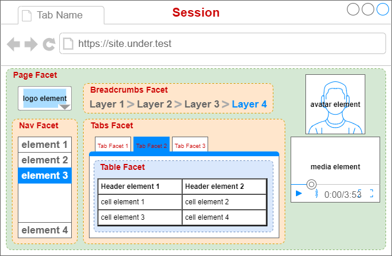

# AFT-UI-Selenium
Automation Framework for Testing (AFT) package providing Selenium-based `IFacet` Plugins and BrowserStack `ISession` Plugins for the `aft-ui` package. This enables testing using BrowserStack's Selenium Grid for any Browser application tests.

## Installation
`> npm i git+https://github.com/bicarbon8/aft-ui-selenium.git`

## Page Object Model (POM)


the POM is a standard design pattern used in UI and layout testing. AFT-UI supports this model via a `Page` class that is made up of one or more `Widget` classes encapsulating logical blocks of functionality on the page. the `Widget` is then made up of one or more `IFacet` implementations. Take the following as an example of how one could interact with the following page https://the-internet.herokuapp.com/login

### Step 1: create the Page model class

```typescript
/**
 * represents the login page object containing widgets encapsulating
 * the functionality of the website
 */
export class HerokuLoginPage extends Page {
    /* widgets contained in this page */
    private content(): Promise<HerokuContentWidget> {
        return this.getWidget(HerokuContentWidget);
    }
    private messages(): Promise<HerokuMessagesWidget> {
        let wo: WidgetOptions = new WidgetOptions(this.container);
        wo.maxWaitMs = 20000;
        return this.getWidget(HerokuMessagesWidget, wo);
    }

    async navigateTo(): Promise<void> {
        await this.container.goTo('https://the-internet.herokuapp.com/login');
        return this.waitUntilDoneLoading();
    }
    async isDoneLoading(): Promise<boolean> {
        let hc: HerokuContentWidget = await this.content();
        return hc.isDoneLoading();
    }

    /* action functions */
    async login(username: string, password: string): Promise<void> {
        let hc: HerokuContentWidget = await this.content();
        return hc.login(username, password);
    }
    async hasMessage(): Promise<boolean> {
        let hm: HerokuMessagesWidget = await this.messages();
        return hm.hasMessage();
    }
    async getMessage(): Promise<string> {
        let hm: HerokuMessagesWidget = await this.messages();
        return hm.getMessage();
    }
}
```

### Step 2: create the Widgets

```typescript
/**
 * represents the content of the login page including the 
 * username and password fields and the login button
 */
export class HerokuContentWidget extends Widget {
    locator: FacetLocator = FacetLocator.id("content");

    /* facets contained in this widget */
    private async usernameInput(): Promise<IFacet> {
        return this.findFirst(FacetLocator.id("username"));
    }
    private async passwordInput(): Promise<IFacet> {
        return this.findFirst(FacetLocator.id("password"));
    }
    private async loginButton(): Promise<IFacet> {
        return this.findFirst(FacetLocator.css("button.radius"));
    }

    async isDoneLoading(): Promise<boolean> {
        let ui: IFacet = await this.usernameInput();
        let pi: IFacet = await this.passwordInput();
        let lb: IFacet = await this.loginButton();
        let uiDisplayed: boolean = await ui.displayed();
        let piDisplayed: boolean = await pi.displayed();
        let lbDisplayed: boolean = await lb.displayed();
        return uiDisplayed && piDisplayed && lbDisplayed;
    }

    /* action functions */
    async login(username: string, password: string): Promise<void> {
        let ui: IFacet = await this.usernameInput();
        await ui.text(username);
        let pi: IFacet = await this.passwordInput();
        await pi.text(password);
        return this.clickSearchButton();
    }
    async clickSearchButton(): Promise<void> {
        let lb: IFacet = await this.loginButton();
        return lb.click();
    }
}
```
```typescript
/**
 * represents the results message content shown on successful 
 * or failed login.
 */
export class HerokuMessagesWidget extends Widget {
    locator: FacetLocator = FacetLocator.id("flash-messages");
    
    /* facets contained in this widget */
    private async message(): Promise<WebElement> {
        return this.findFirst(FacetLocator.id("flash"));
    }

    async isDoneLoading(): Promise<boolean> {
        return this.hasMessage();
    }

    /* action functions */
    async hasMessage(): Promise<boolean> {
        try {
            let el: IFacet = await this.message();
            return el !== undefined;
        } catch (e) {
            return false;
        }
    }
    async getMessage(): Promise<string> {
        let exists: boolean = await this.hasMessage();
        if (exists) {
            let el: IFacet = await this.message();
            return el.text();
        }
        return Promise.reject("no message could be found");
    }
}
```
### Step 3: use them to interact with the web application

```typescript
// creates new Browser session using 'aftconfig.json' 'session_provider' value
let session: ISession = await ISessionGenerator.get();
// creates a HerokuLoginPage instance used to interact with the page
let opts: WidgetOptions = new WidgetOptions(session);
let loginPage: HerokuLoginPage = new HerokuLoginBasePage(opts);
await loginPage.navigateTo(); // navigates to Heroku Login
await loginPage.login("tomsmith", "SuperSecretPassword!");
// check for result message over and over until exists or  a maximum of 20 seconds elapses
await Wait.forCondition(() => loginPage.hasMessage(), 20000);
let message: string = await loginPage.getMessage();
expect(message).toContain("You logged into a secure area!");
```